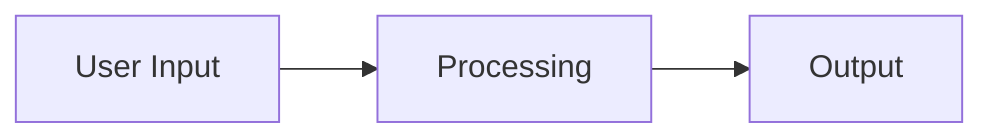

# Behavioural Summary Skill

## Description

Summarises the functional behaviour of the RogedoPoker system: what it does, how it does it, and what the main workflows are. Produces a readable document aimed at someone who needs to understand the system's behaviour without reading the code.

## Trigger

When the user asks for "behavioural summary", "behaviour summary", "what does the system do", "functional overview", or "workflows".

## Instructions

Analyse the solution's source code to understand and document its functional behaviour.

### Procedure

1. Read entry points (Program.cs, controllers, form constructors) to identify how users interact with the system.
2. Read domain logic to understand the core algorithms and processing steps.
3. Trace the main workflows end-to-end (from user action to result).
4. Identify inputs, outputs, and side effects for each workflow.
5. Document any background processes, event-driven behaviour, or scheduled tasks.
6. Write `behavioural-summary.md` using the Output Format below.

### Output Format

```markdown
# Behavioural Summary — RogedoPoker

## What the System Does

<2-3 paragraph plain-English description of the system's purpose and capabilities.>

## How It Works

<High-level explanation of the approach, algorithms, and processing strategy. Avoid code-level detail — describe concepts and flow.>

## Main Workflows

### 1. <Workflow Name>

**Trigger:** <What initiates this workflow>
**Steps:**
1. <Step description>
2. <Step description>
3. <Step description>

**Inputs:** <What data is needed>
**Outputs:** <What is produced>
**Side Effects:** <Any state changes, messages sent, data persisted>

---

### 2. <Workflow Name>

...

## Data Flow



## External Interactions

| System | Direction | Purpose |
|--------|-----------|---------|
| Redis | Read/Write | Cache analysis results |

## Key Behaviours & Rules

<List of important business rules, constraints, or behavioural invariants the system enforces.>

## Edge Cases & Error Handling

<How the system handles invalid input, failures, and boundary conditions.>
```

### Rules

- Read actual source files to understand behaviour — do not guess.
- Describe behaviour from the user's perspective first, then explain internals.
- Use plain English — this document should be understandable by non-developers.
- Trace at least the primary workflow end-to-end with specific steps.
- Include Mermaid flowcharts for complex workflows.
- Note any behaviour that is implicit or relies on convention rather than explicit code.
- Write the report to `behavioural-summary.md` in the repository root, overwriting any existing content.
