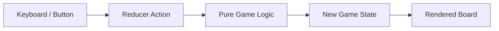

---
name: behavioural-summary
description: Summarises the functional behaviour of the system including what it does, how it does it, and the main workflows.
---

# Behavioural Summary Skill

## Description

Summarises the functional behaviour of the Connect 4 game: what it does, how it does it, and what the main workflows are. Produces a readable document aimed at someone who needs to understand the system's behaviour without reading the code.

## Trigger

When the user asks for "behavioural summary", "behaviour summary", "what does the system do", "functional overview", or "workflows".

## Instructions

Analyse the solution's source code to understand and document its functional behaviour.

### Procedure

1. Read entry points (`src/main.tsx`, `src/components/App.tsx`) to identify how users interact with the system and how screens are selected.
2. Read the pure game logic (`src/logic/gameLogic.ts`, `src/logic/ai.ts`, `src/logic/types.ts`) to understand the core algorithms (drop mechanics, win/draw detection, the Computer heuristic).
3. Read the state layer (`src/hooks/useGameReducer.ts`) and the input/output hooks (`src/hooks/useKeyboard.ts`, `src/hooks/useSound.ts`) to understand how actions flow through the app.
4. Trace the main workflows end-to-end (from a keypress or button click to a board update and rendered result).
5. Identify inputs, outputs, and side effects for each workflow (state changes, sound playback, win-counter updates).
6. Document any timed or effect-driven behaviour, such as the delayed Computer move scheduled via `setTimeout`.
7. Write `behavioural-summary.md` using the Output Format below.

### Output Format

```markdown
# Behavioural Summary — Connect 4

## What the System Does

<2-3 paragraph plain-English description of the game's purpose and capabilities.>

## How It Works

<High-level explanation of the approach, algorithms, and processing strategy. Avoid code-level detail — describe concepts and flow.>

## Main Workflows

### 1. <Workflow Name>

**Trigger:** <What initiates this workflow>
**Steps:**
1. <Step description>
2. <Step description>
3. <Step description>

**Inputs:** <What data is needed>
**Outputs:** <What is produced>
**Side Effects:** <Any state changes, sounds played, counters updated>

---

### 2. <Workflow Name>

...

## Data Flow



## External Interactions

| System | Direction | Purpose |
|--------|-----------|---------|
| HTMLAudioElement (`/sounds/*.mp3`) | Write (playback) | Play drop/win/lose/draw/invalid sound effects |

## Key Behaviours & Rules

<List of important game rules, constraints, or behavioural invariants the system enforces — e.g. discs fall to the lowest empty row, drops into full columns are rejected, an ended game rejects further drops.>

## Edge Cases & Error Handling

<How the system handles invalid input, full columns, ended games, and boundary conditions.>
```

### Rules

- Read actual source files to understand behaviour — do not guess.
- Describe behaviour from the player's perspective first, then explain internals.
- Use plain English — this document should be understandable by non-developers.
- Trace at least the primary workflow (a Human drop followed by the Computer's response) end-to-end with specific steps.
- Include Mermaid flowcharts for complex workflows.
- Note any behaviour that is implicit or relies on convention rather than explicit code (e.g. the `board[col][row]` layout with row 0 as the lowest row).
- Write the report to `behavioural-summary.md` in the repository root, overwriting any existing content.
