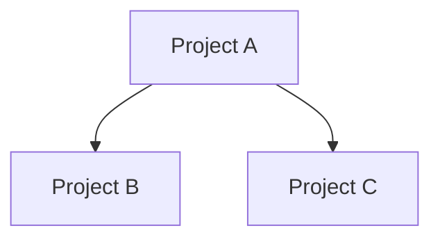

# Dependency Map Skill

## Description

Creates a dependency map of the RogedoPoker solution covering projects, namespaces, and major classes. Highlights tight coupling, implicit contracts, and any architectural drift.

## Trigger

When the user asks for "dependency map", "dependencies", "coupling analysis", or "dependency graph".

## Instructions

Analyse the solution's dependency structure at three levels: project, namespace, and class. Identify problematic coupling patterns and write the results to `dependency-map.md`.

### Procedure

1. Read the solution file(s) to identify all projects.
2. Read each project's `.csproj` to map project-to-project references.
3. Read source files to identify:
   - Namespaces used within each project
   - `using` statements to determine cross-namespace dependencies
   - Major classes and their direct dependencies (constructor parameters, field types, method parameters)
4. Identify tight coupling:
   - Classes that depend on concrete implementations rather than interfaces
   - Projects with circular or excessive cross-references
   - Classes with high fan-out (depending on many other classes)
5. Identify implicit contracts:
   - Static classes/methods used across boundaries
   - Shared mutable state
   - Convention-based coupling (e.g. string-based lookups, reflection)
6. Identify architectural drift:
   - Projects that violate their apparent layer (e.g. domain depending on infrastructure)
   - Inconsistent dependency direction
   - Test projects referencing internals they shouldn't need
7. Write `dependency-map.md` using the Output Format below.

### Output Format

```markdown
# Dependency Map — RogedoPoker

## Overview

<Summary of the dependency landscape: how many projects, overall coupling health, key findings.>

## Project Dependencies



## Namespace Map

| Project | Namespaces | Depends On |
|---------|-----------|------------|
| AnalysisEngine.Domain | AnalysisEngine.Domain.Domain, .Objects, .Factory | (none — leaf) |

## Key Classes & Their Dependencies

| Class | Project | Depends On | Fan-Out |
|-------|---------|-----------|---------|
| Factory | AnalysisEngine.Domain | Deck, Deal, HoleCards, Card | 4 |

## Tight Coupling

| # | Location | Issue | Severity |
|---|----------|-------|----------|
| 1 | `ClassName` in `ProjectName` | Depends on concrete `OtherClass` instead of interface | Medium |

## Implicit Contracts

| # | Location | Contract Type | Description |
|---|----------|--------------|-------------|
| 1 | `Shuffle.ServeNext` | Static shared state | Global random counter used across Card instances |

## Architectural Drift

| # | Finding | Expected | Actual | Impact |
|---|---------|----------|--------|--------|
| 1 | Domain references infrastructure | Domain should be dependency-free | Depends on X | High |

## Summary & Recommendations

<Prioritised list of coupling issues to address, ordered by impact.>
```

### Rules

- Read actual project files and source code — do not guess at dependencies.
- Include all projects (source, test, tools).
- For the class-level analysis, focus on public/internal classes with 3+ dependencies (fan-out ≥ 3).
- Severity levels: High (runtime risk or blocks refactoring), Medium (maintainability concern), Low (style or minor improvement).
- Architectural drift is relative to the apparent layering — infer the intended layers from project names and structure.
- Write the report to `dependency-map.md` in the repository root, overwriting any existing content.
