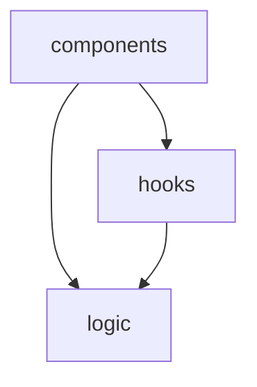

---
name: dependency-map
description: Creates a dependency map of the solution highlighting tight coupling, implicit contracts, and architectural drift.
---

# Dependency Map Skill

## Description

Creates a dependency map of the Connect 4 solution covering layers, modules, and major functions/components. Highlights tight coupling, implicit contracts, and any architectural drift.

## Trigger

When the user asks for "dependency map", "dependencies", "coupling analysis", or "dependency graph".

## Instructions

Analyse the solution's dependency structure at three levels: layer (logic / hooks / components), module (individual `.ts`/`.tsx` files), and export (functions, components, hooks). Identify problematic coupling patterns and write the results to `dependency-map.md`.

### Procedure

1. Read `package.json` to identify runtime and dev dependencies and the available scripts.
2. Read the source tree under `src/` to identify the layers: pure logic (`src/logic`), React hooks (`src/hooks`), and components (`src/components`).
3. Read source files to identify:
   - `import` statements to determine cross-module and cross-layer dependencies
   - Major exports (functions, hooks, components) and their direct dependencies (parameters, imported symbols)
   - Which modules are leaves (e.g. `src/logic/types.ts`) versus hubs
4. Identify tight coupling:
   - Components that reach directly into logic instead of going through hooks/state
   - Modules with high fan-out (importing from many other modules)
   - Test-only helpers (`src/logic/testGenerators.ts`) leaking into production paths
5. Identify implicit contracts:
   - Shared conventions such as the `board[col][row]` layout with row 0 lowest
   - Sentinel values (`landedRow: -1`, `selectedColumn: -1` meaning "none", `chooseComputerColumn` returning `-1`)
   - String-keyed lookups (sound names, disc colours `'R'`/`'Y'`)
6. Identify architectural drift:
   - Logic importing from hooks or components (should be dependency-free)
   - Hooks importing from components
   - Inconsistent dependency direction across layers
7. Write `dependency-map.md` using the Output Format below.

### Output Format

```markdown
# Dependency Map — Connect 4

## Overview

<Summary of the dependency landscape: how many modules per layer, overall coupling health, key findings.>

## Layer Dependencies



## Module Map

| Layer | Modules | Depends On |
|-------|---------|------------|
| logic | types.ts, gameLogic.ts, ai.ts | types.ts (leaf) |

## Key Exports & Their Dependencies

| Export | Module | Depends On | Fan-Out |
|--------|--------|-----------|---------|
| chooseComputerColumn | logic/ai.ts | openColumns, dropDisc, checkWinAt, CENTER_COL | 4 |

## Tight Coupling

| # | Location | Issue | Severity |
|---|----------|-------|----------|
| 1 | `Component` in `components/` | Calls logic directly instead of via a hook | Medium |

## Implicit Contracts

| # | Location | Contract Type | Description |
|---|----------|--------------|-------------|
| 1 | `board[col][row]` | Layout convention | Row 0 is the lowest row; relied on across logic and rendering |

## Architectural Drift

| # | Finding | Expected | Actual | Impact |
|---|---------|----------|--------|--------|
| 1 | logic imports a hook | logic should be dependency-free | Depends on X | High |

## Summary & Recommendations

<Prioritised list of coupling issues to address, ordered by impact.>
```

### Rules

- Read actual source files and `package.json` — do not guess at dependencies.
- Include all modules across `src/logic`, `src/hooks`, and `src/components` (plus test files where relevant).
- For the export-level analysis, focus on functions/hooks/components with 3+ dependencies (fan-out >= 3).
- Severity levels: High (runtime risk or blocks refactoring), Medium (maintainability concern), Low (style or minor improvement).
- Architectural drift is relative to the intended layering: components -> hooks -> logic, with `logic` as a pure, dependency-free core.
- Write the report to `dependency-map.md` in the repository root, overwriting any existing content.
