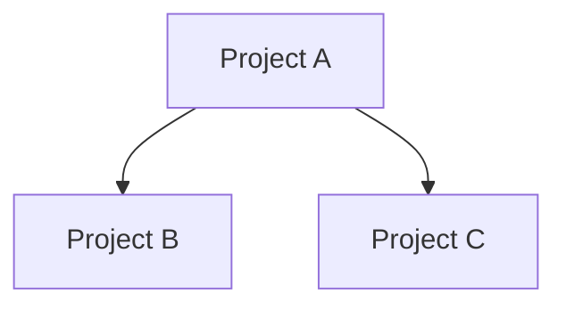

# High-Level Architecture Skill

## Description

Generates a retrospective architecture overview of the RogedoPoker C# solution. Analyses the project structure, domain boundaries, major dependencies, external integrations, and inferred design intentions, then writes the results to `high-level-architecture.md` in the repository root.

## Trigger

When the user asks for "architecture", "high-level architecture", "solution architecture", or "architecture overview".

## Instructions

Analyse the solution and produce a comprehensive architecture document.

### Procedure

1. Read the solution file(s) to identify all projects and their types (class library, console app, web app, test project).
2. Read each project's `.csproj` to identify:
   - Target framework
   - Project references (internal dependencies)
   - NuGet package references (external dependencies)
   - Output type (Exe, Library, WinExe)
3. Read key source files in each project to understand responsibilities and domain boundaries.
4. Identify external integrations (databases, message queues, caches, APIs, file I/O).
5. Map the dependency graph between projects.
6. Infer design patterns and architectural intentions from the code structure.
7. Write `high-level-architecture.md` using the Output Format below.

### Output Format

```markdown
# High-Level Architecture — RogedoPoker

## Overview

<2-3 paragraph summary of what the solution does, its architectural style, and key design decisions.>

## Project Structure

| Project | Type | Framework | Purpose |
|---------|------|-----------|---------|
| AnalysisEngine.Domain | Class Library | net10.0 | Core poker analysis domain logic |

## Domain Boundaries

<Describe the logical domains/bounded contexts in the solution and what each is responsible for.>

## Dependency Graph



## External Integrations

| Integration | Technology | Used By | Purpose |
|-------------|-----------|---------|---------|
| Redis | StackExchange.Redis | DataCaching | Caching analysis results |

## NuGet Dependencies

| Package | Version | Used By | Purpose |
|---------|---------|---------|---------|
| xunit | 2.9.3 | Test projects | Unit testing framework |

## Inferred Design Intentions

<Describe the architectural patterns observed: layering, separation of concerns, DI usage, domain-driven design elements, etc.>

## Observations & Recommendations

<Any architectural observations, potential improvements, or risks identified during analysis.>
```

### Rules

- Read the actual project files and source code before reporting — do not guess.
- Include all projects in the solution (including test projects, tools, and benchmarks).
- For the dependency graph, use Mermaid `graph TD` syntax showing project-to-project references.
- Identify both internal (project) and external (NuGet/system) dependencies.
- Note any patterns like Factory, Decorator, Strategy, or Repository that are evident in the code.
- Write the report to `high-level-architecture.md` in the repository root, overwriting any existing content.
