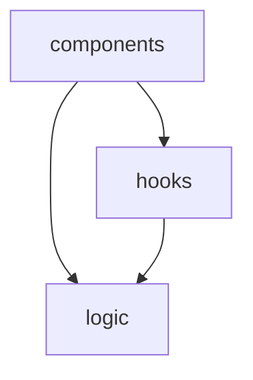

---
name: high-level-architecture
description: Generates a retrospective architecture overview of the solution including project structure, domain boundaries, dependencies, external integrations, and inferred design intentions.
---

# High-Level Architecture Skill

## Description

Generates a retrospective architecture overview of the Connect 4 TypeScript + React solution. Analyses the source structure, layer boundaries, major dependencies, external integrations, and inferred design intentions, then writes the results to `high-level-architecture.md` in the repository root.

## Trigger

When the user asks for "architecture", "high-level architecture", "solution architecture", or "architecture overview".

## Instructions

Analyse the solution and produce a comprehensive architecture document.

### Procedure

1. Read `package.json` and the config files (`vite.config.ts`, `tsconfig*.json`) to identify:
   - The runtime stack (React 18, React DOM) and build tooling (Vite, TypeScript)
   - The test stack (Vitest, jsdom, fast-check, Testing Library, v8 coverage)
   - Available scripts and how the app is built and tested
2. Read the source tree under `src/` to identify the layers and their roles:
   - `src/logic` — pure, framework-free game logic and types
   - `src/hooks` — React state (`useGameReducer`) and I/O hooks (`useKeyboard`, `useSound`)
   - `src/components` — presentational and composition components
3. Read key source files in each layer to understand responsibilities and boundaries.
4. Identify external integrations (audio playback via `HTMLAudioElement`, static assets under `public/`).
5. Map the dependency graph between layers and major modules.
6. Infer design patterns and architectural intentions from the code structure (reducer pattern, pure core, immutable board updates, discriminated-union game status).
7. Write `high-level-architecture.md` using the Output Format below.

### Output Format

```markdown
# High-Level Architecture — Connect 4

## Overview

<2-3 paragraph summary of what the solution does, its architectural style, and key design decisions.>

## Source Structure

| Path | Type | Purpose |
|------|------|---------|
| `src/logic` | Pure module | Core game rules, win/draw detection, Computer heuristic |
| `src/hooks` | React hooks | Reducer-based state plus keyboard and sound I/O |
| `src/components` | React components | Board rendering and screen composition |

## Layer Boundaries

<Describe the logical layers and what each is responsible for, emphasising the pure `logic` core that is independent of React.>

## Dependency Graph



## External Integrations

| Integration | Technology | Used By | Purpose |
|-------------|-----------|---------|---------|
| Audio playback | HTMLAudioElement | `useSound` | Play sound effects from `public/sounds/*.mp3` |

## Dependencies

| Package | Version | Used By | Purpose |
|---------|---------|---------|---------|
| react | ^18.3.1 | app | UI runtime |
| vitest | ^3.2.x | tests | Test runner |
| fast-check | ^3.23.x | tests | Property-based testing |

## Inferred Design Intentions

<Describe the architectural patterns observed: the pure-logic core, the reducer pattern for state, immutable board updates, the discriminated-union GameStatus, separation of I/O into hooks, and the property-based testing strategy.>

## Observations & Recommendations

<Any architectural observations, potential improvements, or risks identified during analysis.>
```

### Rules

- Read the actual config and source files before reporting — do not guess.
- Include all layers and notable modules (including test files, generators, and the coverage setup).
- For the dependency graph, use Mermaid `graph TD` syntax showing layer-to-layer and key module dependencies.
- Identify both internal (module) and external (npm/browser) dependencies.
- Note patterns like the reducer pattern, pure functional core, immutable updates, and discriminated unions that are evident in the code.
- Write the report to `high-level-architecture.md` in the repository root, overwriting any existing content.
