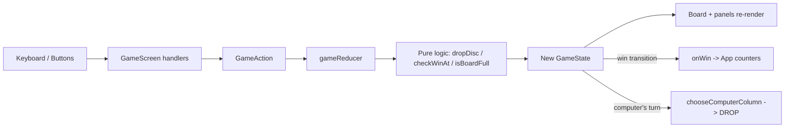

# Behavioural Summary — Connect 4

## What the System Does

Connect 4 is a browser game in which one human plays against a computer
opponent on the classic 7-column by 6-row vertical grid. From a home screen the
player chooses their disc colour (Red or Yellow, Red by default) and starts a
game; the human always moves first. Play is entirely keyboard-driven: the Left
and Right arrows move a column selector, the Down arrow drops a disc into the
selected column, R restarts the current game, and Q returns to the home screen.

A disc dropped into a column falls to the lowest empty cell. The first player to
line up four of their discs in a row — horizontally, vertically, or
diagonally — wins; if the board fills with no such line, the game is a draw. The
computer responds automatically after each human move using a simple heuristic.
Wins, losses, and draws are announced on screen (and read out to assistive
technology), accompanied by sound effects, and a running win tally for each side
is kept for the session.

The whole application runs client-side with no backend or persistence beyond
in-memory session state. It also offers a debug toggle that visualises each
side's longest current chain, and an in-game mute control for the sound effects.

## How It Works

The game separates its rules from its presentation. A pure, framework-free
"rules engine" knows how to create a board, drop a disc, detect a win or draw,
and compute the longest chain for a colour — all as side-effect-free functions
that take a board and return new data without mutating anything. On top of this
sits a single reducer that holds the current game state (board, whose turn it
is, the outcome, the selected column, and the debug flag) and applies actions to
it. React components render that state and translate user input into actions.

The board is stored as `board[col][row]` with row 0 as the lowest row, matching
gravity. Win detection scans the four axes (horizontal, vertical, and both
diagonals) outward from a just-placed disc. The computer's choice is a
prioritised heuristic: take an immediate winning move if one exists, otherwise
block the human's immediate winning move, otherwise prefer the open column
closest to the centre (ties resolve to the lower index). The game outcome is
modelled as a small state machine — playing, win, or draw — so end-of-game
behaviour (like rejecting further drops) is explicit.

## Main Workflows

### 1. Start a Game

**Trigger:** The player picks a colour on the home screen and activates "Start Game".
**Steps:**
1. The home screen tracks the chosen disc locally and reports it on start.
2. The root component records the human's colour and switches to the game screen.
3. A fresh game is initialised: an empty board, the human to move, the selector
   at the centre column, and debug off. (The game screen is remounted so its
   per-game state is clean.)

**Inputs:** Chosen disc colour.
**Outputs:** A new game screen with an empty board.
**Side Effects:** Screen changes to "game"; session win counters are preserved.

---

### 2. Human Drop (and the Computer's Reply)

**Trigger:** The human presses Down to drop into the selected column (after moving
it with Left/Right).
**Steps:**
1. If it is not the human's turn or the game has ended, the keypress is ignored.
2. If the selected column is full, an "invalid" sound plays and nothing changes.
3. Otherwise a "drop" sound plays and a DROP action is dispatched.
4. The reducer places the disc in the lowest empty row, then checks for a win
   around that cell, then for a full-board draw; if neither, it hands the turn
   to the computer.
5. When it becomes the computer's turn (and the game is still playing), an effect
   waits ~400 ms, computes the computer's column, plays "drop", and dispatches
   the computer's DROP.

**Inputs:** Current board, selected column, whose turn it is.
**Outputs:** An updated board and turn/outcome state.
**Side Effects:** Sound playback; turn alternation; possible transition to a
terminal (win/draw) state.

---

### 3. Game Ends (Win or Draw)

**Trigger:** A drop completes four-in-a-row, or fills the last empty cell with no line.
**Steps:**
1. The reducer sets the status to `win` (recording the winner, disc, and winning
   cells) or `draw`.
2. On the first transition into a terminal state, the game screen plays "win" if
   the human won or "lose" if the computer won (or "draw"), and notifies the root
   once so it increments the winner's counter exactly once.
3. The board highlights the winning line; the column selector highlight is
   suppressed; further drops are rejected.

**Inputs:** The terminal game status.
**Outputs:** Outcome announcement, highlighted winning line, updated counters.
**Side Effects:** Sound playback; a single counter increment.

---

### 4. Restart / Return Home

**Trigger:** The player presses R (restart) or Q (home).
**Steps:**
1. R dispatches RESTART: the reducer clears the board and returns the human to
   move, preserving the chosen colours; the selector resets to centre.
2. Q calls back to the root, which switches to the home screen.

**Inputs:** None beyond the keypress.
**Outputs:** A cleared game (R) or the home screen (Q).
**Side Effects:** Session win counters are retained across both.

## Data Flow

## External Interactions

| System | Direction | Purpose |
|--------|-----------|---------|
| HTMLAudioElement (`/sounds/*.mp3`) | Write (playback) | Play drop / win / lose / draw / invalid sound effects |
| Document keyboard events | Read | Keyboard-only control scheme (arrows, R, Q) |

## Key Behaviours & Rules

- Discs fall to the lowest empty row of the chosen column (`board[col][row]`,
  row 0 lowest).
- A drop into a full column is rejected and leaves the board unchanged (with an
  "invalid" sound during play).
- The human always moves first; valid non-terminal drops alternate the turn.
- Four-in-a-row in any of the four directions wins; a full board with no line is
  a draw.
- Once the game has ended, further drops are rejected (the state is unchanged).
- The winner's counter increments exactly once per game; counters persist across
  restart, return-home, and starting a new game.
- Column selection wraps around the board (moving left from column 0 goes to
  column 6, and vice versa).
- Movement and drops are inert while it is the computer's turn or the game is
  over; R (restart) and Q (home) always work.

## Edge Cases & Error Handling

- **Full column:** rejected without changing the board; "invalid" sound plays.
- **Ended game:** DROP actions are no-ops; the reducer returns the same state.
- **Board full with no winner:** classified as a draw.
- **Missing/blocked audio:** `HTMLAudioElement.play()` rejections (e.g. browser
  autoplay policy or a missing asset) are caught and ignored so gameplay is
  never blocked — the trade-off is that audio can fail silently.
- **Longer-than-four runs:** win detection returns the full run; the reported
  longest-chain length is capped at four.
- **Computer with a full board:** the heuristic returns -1 and no move is made.
