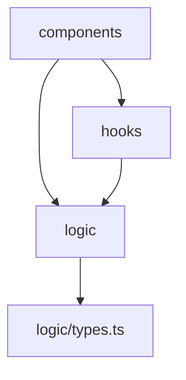

# Dependency Map — Connect 4

## Overview

The solution is small and cleanly layered. Source lives under `src/` in three
layers: pure game logic (`src/logic`, 3 modules + 1 test-only generator file),
React state and I/O hooks (`src/hooks`, 3 modules), and React components
(`src/components`, 9 modules plus CSS Modules). The dependency direction is
strict and acyclic: components depend on hooks and logic, hooks depend on logic,
and logic depends only on its own `types.ts`. There are no circular
dependencies and no back-edges (nothing in `logic` imports from `hooks` or
`components`). Overall coupling is healthy; the notable items are a handful of
convention-based implicit contracts rather than structural problems.

## Layer Dependencies

## Module Map

| Layer | Modules | Depends On |
|-------|---------|------------|
| logic | `types.ts`, `gameLogic.ts`, `ai.ts` | `types.ts` is a leaf; `gameLogic.ts` -> `types`; `ai.ts` -> `types`, `gameLogic` |
| hooks | `useGameReducer.ts`, `useKeyboard.ts`, `useSound.ts` | `useGameReducer` -> `logic/types`, `logic/gameLogic`; `useKeyboard`/`useSound` -> React only |
| components | `App`, `HomeScreen`, `GameScreen`, `Board`, `Cell`, `CurrentPlayerIndicator`, `StatusBar`, `ScorePanel`, `DebugPanel` | see class-level table below |
| test support | `logic/testGenerators.ts` | `logic/types`, `logic/gameLogic` (imported only by test files) |

## Key Exports & Their Dependencies

| Export | Module | Depends On | Fan-Out |
|--------|--------|-----------|---------|
| `chooseComputerColumn` | `logic/ai.ts` | `openColumns`, `dropDisc`, `checkWinAt`, `CENTER_COL` | 4 |
| `gameReducer` / `useGameReducer` | `hooks/useGameReducer.ts` | `createEmptyBoard`, `dropDisc`, `checkWinAt`, `isBoardFull`, `COLS`, `CENTER_COL`, types | 6 |
| `GameScreen` | `components/GameScreen.tsx` | `Board`, `CurrentPlayerIndicator`, `StatusBar`, `ScorePanel`, `DebugPanel`, `useGameReducer`, `useKeyboard`, `useSound`, `chooseComputerColumn`, `longestChain` | 10 |
| `App` | `components/App.tsx` | `HomeScreen`, `GameScreen`, types | 3 |
| `Board` | `components/Board.tsx` | `Cell`, `COLS`, `ROWS`, types | 3 |
| `longestChain` / `checkWinAt` | `logic/gameLogic.ts` | `DIRECTIONS`, `inBounds`, `COLS`, `ROWS`, `CONNECT`, types | (intra-module) |

## Tight Coupling

| # | Location | Issue | Severity |
|---|----------|-------|----------|
| 1 | `GameScreen` in `components/` | Highest fan-out in the app (10): it is the composition root that wires all three hooks, the AI, the logic helper, and five child components. Concentrated but appropriate for a coordinator. | Low |
| 2 | `GameScreen` -> `logic/ai` and `logic/gameLogic` directly | A component reaches past the hook layer straight into logic (`chooseComputerColumn`, `longestChain`) rather than exposing these through `useGameReducer`. Works, but blurs the components -> hooks -> logic boundary slightly. | Low |

## Implicit Contracts

| # | Location | Contract Type | Description |
|---|----------|--------------|-------------|
| 1 | `board[col][row]` across `logic`, `Board`, `Cell` | Layout convention | Column-major with row 0 as the lowest row; `Board` reverses row order when rendering so gravity looks correct. Relied on everywhere but never enforced by a type. |
| 2 | `-1` sentinel | Shared magic value | Means "none" in three places: failed-drop `landedRow`, `chooseComputerColumn` on a full board, and `selectedColumn={-1}` to suppress the selection highlight. |
| 3 | Disc codes `'R'` / `'Y'` | String keys | Used as literal disc values, sound-gating branches, and CSS colour selection; a stringly-typed contract shared by logic and UI. |
| 4 | Sound names | String keys | `useSound` maps `'drop' | 'win' | 'lose' | 'draw' | 'invalid'` to asset paths; `GameScreen` must pass matching names, and the assets must exist under `public/sounds`. |
| 5 | `status.cells` from `checkWinAt` | Data-shape assumption | The winning-cells array can exceed four for a 5+ run; consumers (`Board` winning-line highlight) treat it as "the winning line" regardless of length. |
| 6 | `onWin` called exactly once | Temporal contract | `GameScreen` guards with a ref so it notifies `App` once per win transition; `App`'s counter increment depends on this "exactly once" behaviour. |

## Architectural Drift

| # | Finding | Expected | Actual | Impact |
|---|---------|----------|--------|--------|
| 1 | Logic layer purity | `logic` depends only on itself | Holds — `types.ts` is a leaf; `gameLogic`/`ai` import nothing outside `logic` | None (healthy) |
| 2 | Hook independence from UI | `hooks` never import `components` | Holds | None (healthy) |
| 3 | Components routing state through hooks | Components mutate state only via the reducer/hooks | Mostly holds; `GameScreen` also calls `logic` helpers (`chooseComputerColumn`, `longestChain`) directly | Low — a minor boundary blur, not a cycle |
| 4 | Test-only code isolated from runtime | `testGenerators.ts` used only by tests | Holds — imported only by `*.test.ts(x)`; also excluded from coverage | None (healthy) |

## Summary & Recommendations

The dependency structure is in good shape: a pure logic core, an I/O-isolating
hook layer, and a component layer, all pointing inward with no cycles. The only
things worth noting are low-impact:

1. `GameScreen` carries the app's highest fan-out and reaches directly into
   `logic` for the AI move and longest-chain. If it grows further, consider
   surfacing the computer move and debug-chain data through `useGameReducer`
   (or a dedicated hook) so components depend on hooks rather than logic.
2. The `-1` "none" sentinel is overloaded across three unrelated concepts;
   named constants per use would make intent clearer.
3. The stringly-typed contracts (disc codes, sound names, the `board[col][row]`
   layout) are consistent today but rely on convention; they are the most
   likely places for a future change to introduce a silent mismatch — the
   swallowed audio `play()` rejection in particular can hide a broken sound-name
   or missing-asset contract.
