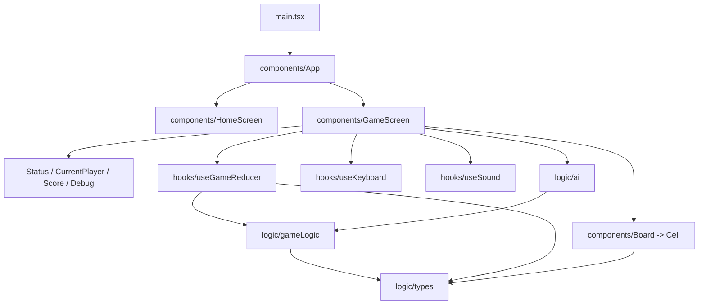

# High-Level Architecture — Connect 4

## Overview

Connect 4 is a single-page, browser-based game in which one human plays against
a computer opponent on the classic 7-column by 6-row grid. It is built with
React 18 and TypeScript, bundled by Vite, and controlled entirely from the
keyboard (arrows to move and drop, R to restart, Q to return home). There is no
backend, no network, and no persistence beyond in-memory session state — the
whole application runs client-side.

Architecturally the solution is a "functional core, imperative shell": a pure,
framework-free rules engine (`src/logic`) sits at the centre, wrapped by React
state and I/O hooks (`src/hooks`), and rendered by presentational and
composition components (`src/components`). Game rules never depend on React, and
the dependency direction is strictly components -> hooks -> logic.

Correctness is a first-class design goal. The pure logic is validated with
property-based tests (fast-check) alongside React Testing Library component and
end-to-end keyboard tests, all run under Vitest in a jsdom environment with v8
coverage configured.

## Source Structure

| Path | Type | Purpose |
|------|------|---------|
| `index.html` / `src/main.tsx` | Entry point | Mounts `<App />` into `#root` under React `StrictMode` |
| `src/logic/types.ts` | Pure module (types + constants) | Domain types (`Disc`, `Board`, `GameStatus`, `Coord`, ...) and constants (`COLS`, `ROWS`, `CONNECT`, `CENTER_COL`) |
| `src/logic/gameLogic.ts` | Pure module | Board creation, drop mechanics, win/draw detection, longest-chain computation, shared `DIRECTIONS` |
| `src/logic/ai.ts` | Pure module | `chooseComputerColumn` — the computer opponent heuristic |
| `src/hooks/useGameReducer.ts` | React hook + reducer | Pure `gameReducer` and `useReducer` wrapper owning per-game state |
| `src/hooks/useKeyboard.ts` | React hook | Document `keydown` listener mapping keys to handler callbacks |
| `src/hooks/useSound.ts` | React hook | Preloads and plays sound effects via `HTMLAudioElement` |
| `src/components/App.tsx` | Composition | Owns screen selection, chosen colour, and session win counters |
| `src/components/HomeScreen.tsx` | Presentation | Colour choice, start, counters, keyboard instructions |
| `src/components/GameScreen.tsx` | Composition | Wires reducer + keyboard + sound and composes the board and panels |
| `src/components/Board.tsx` / `Cell.tsx` | Presentation | Render the grid and individual cells (selected/chain/winning highlights) |
| `src/components/CurrentPlayerIndicator.tsx` / `StatusBar.tsx` | Presentation | `aria-live` turn and outcome announcements |
| `src/components/ScorePanel.tsx` / `DebugPanel.tsx` | Presentation | Score display and debug (longest-chain) panel |
| `src/**/*.test.ts(x)` | Tests | Property, unit, RTL component, and keyboard end-to-end tests |
| `src/logic/testGenerators.ts` | Test support | fast-check arbitraries (reachable boards, planted chains, draw boards) |

## Layer Boundaries

- **Logic (`src/logic`)** is the pure core. It has no React dependency and no
  side effects: functions take a `Board` (and related values) and return new
  data. `types.ts` is effectively a leaf that everything else imports. This is
  the layer the property tests target directly.
- **Hooks (`src/hooks`)** hold state and isolate I/O. `useGameReducer` is the
  single writer of game state, delegating rule decisions to `logic`.
  `useKeyboard` and `useSound` quarantine DOM event listening and audio
  playback behind small, declarative interfaces.
- **Components (`src/components`)** are the imperative shell. `App` and
  `GameScreen` compose hooks and presentational components; the leaf components
  (`Board`, `Cell`, `StatusBar`, etc.) are close to pure functions of their
  props. All mutation is pushed down into the reducer/logic.

## Dependency Graph

## External Integrations

| Integration | Technology | Used By | Purpose |
|-------------|-----------|---------|---------|
| Audio playback | `HTMLAudioElement` | `hooks/useSound` | Play `drop` / `win` / `lose` / `draw` / `invalid` effects from `public/sounds/*.mp3` |
| DOM keyboard events | `document` `keydown` | `hooks/useKeyboard` | Keyboard-only control scheme |
| Static assets | Vite `public/` | runtime | Serves `public/sounds/*.mp3` at `/sounds/*.mp3` |

There is no database, message queue, HTTP API, or server component — the game is
entirely client-side.

## Dependencies

| Package | Version | Used By | Purpose |
|---------|---------|---------|---------|
| react | ^18.3.1 | app | UI runtime |
| react-dom | ^18.3.1 | app | DOM rendering (`createRoot`) |
| vite | ^6.0.5 | build/dev | Dev server and production bundler |
| @vitejs/plugin-react | ^4.3.4 | build | React fast-refresh + JSX transform |
| typescript | ^5.7.2 | build | Type checking (`tsc -b` before `vite build`) |
| vitest | ^3.2.4 | tests | Test runner (jsdom environment, globals) |
| @vitest/coverage-v8 | ^3.2.7 | tests | Coverage provider for `npm run coverage` |
| fast-check | ^3.23.2 | tests | Property-based testing |
| @testing-library/react | ^16.1.0 | tests | Component rendering/queries |
| @testing-library/user-event | ^14.5.2 | tests | Simulated user/keyboard interaction |
| @testing-library/jest-dom | ^6.6.3 | tests | DOM matchers |
| jsdom | ^25.0.1 | tests | Headless DOM for the test environment |

Build/test configuration lives in `vite.config.ts` (React plugin, CSS Modules
with `camelCaseOnly`, jsdom test env, and v8 coverage that excludes test files,
test helpers, `main.tsx`, and declaration files) and `tsconfig.app.json` (strict
mode with `noUnusedLocals`, `noUnusedParameters`, `noFallthroughCasesInSwitch`).

## Inferred Design Intentions

- **Functional core / imperative shell.** Deterministic rules in `src/logic`;
  side effects (keyboard, audio, timers, navigation) confined to hooks and the
  `App`/`GameScreen` shell.
- **Reducer as single source of truth.** `gameReducer` is a pure function
  handling `DROP`, `MOVE_SELECTION`, `RESTART`, and `TOGGLE_DEBUG`, making every
  transition centralised and unit-testable without rendering.
- **State machine via discriminated union.** `GameStatus`
  (`playing` | `win` | `draw`) makes illegal states unrepresentable and forces
  exhaustive handling; win status carries the winning `cells` for highlighting.
- **Immutability.** `dropDisc` copies the affected column and never mutates its
  input; React state uses functional updaters. This underpins the property
  tests (e.g. "a rejected drop leaves the board unchanged").
- **Strategy-as-function AI.** `chooseComputerColumn` encodes a prioritised
  heuristic — take an immediate win, else block the human's immediate win, else
  prefer the column closest to centre (ties to the lower index) — kept pure and
  independently testable.
- **Ownership boundary for persistence.** `App` owns session win counters and
  remounts `GameScreen` via a changing `key` (`gameId`) so a new game resets the
  board without resetting counters.
- **Accessibility by intent.** Keyboard-first control, `role="grid"`/`gridcell`
  on the board, and `aria-live` status regions for turn and outcome
  announcements.
- **Testability as an architectural driver.** The pure core plus fast-check
  arbitraries in `testGenerators.ts` show the layering was chosen partly to
  enable property-based verification.

## Observations & Recommendations

- **Silent audio failures.** `useSound` intentionally swallows `play()`
  rejections so gameplay is never blocked; the trade-off is that a missing or
  misnamed asset fails completely silently. A dev-only warning on load failure
  would aid debugging.
- **Gating lives outside the input hook.** `useKeyboard` deliberately does no
  game-state gating (the "no-op while it's the computer's turn / game over" rule
  is enforced in `GameScreen`). This keeps the hook reusable but places the
  invariant away from where events originate.
- **`-1` as an overloaded sentinel.** `-1` signals several distinct "none"
  concepts (failed-drop row, no AI column, suppressed selection highlight).
  Clear individually, but a named constant per use would reduce ambiguity.
- **Winning-cell set is not capped at four.** `checkWinAt` returns the full run,
  so a 5+ run stores more than four cells in `status.cells`; handled
  consistently downstream, but worth noting versus `longestChain`, which caps at
  `CONNECT`.
- **No app-level sound setting.** Muting exists in-game via `GameScreen`, but
  there is no persisted, home-screen sound preference; lifting it into `App`
  would mirror how win counters are already handled.
